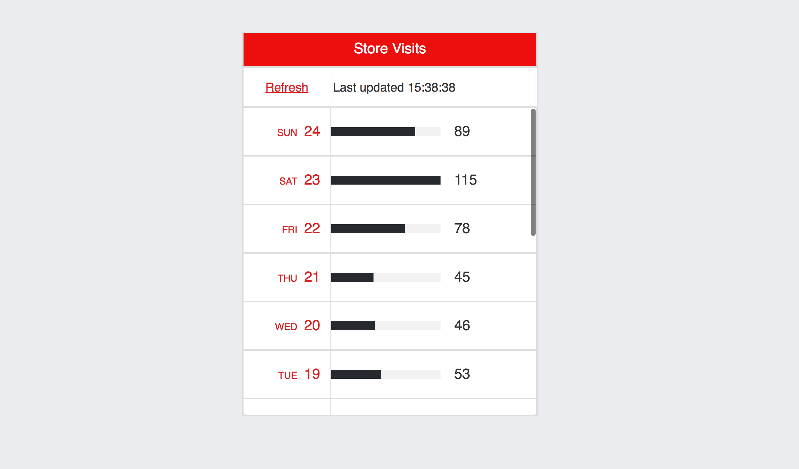
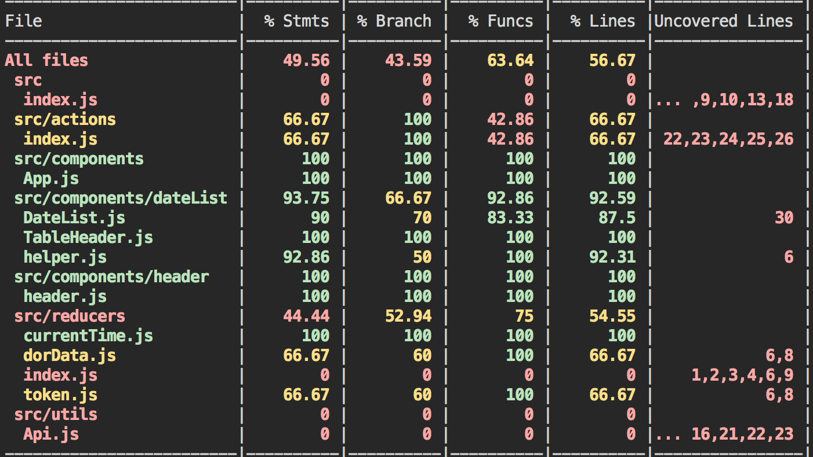
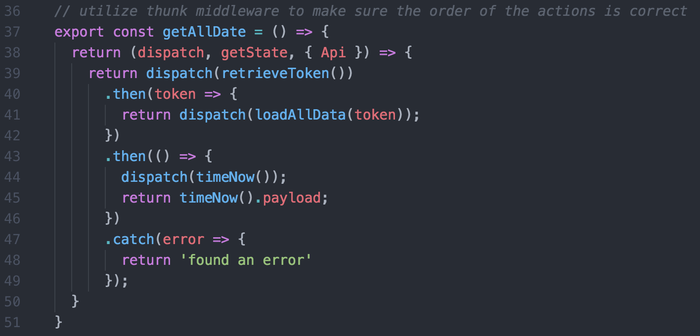
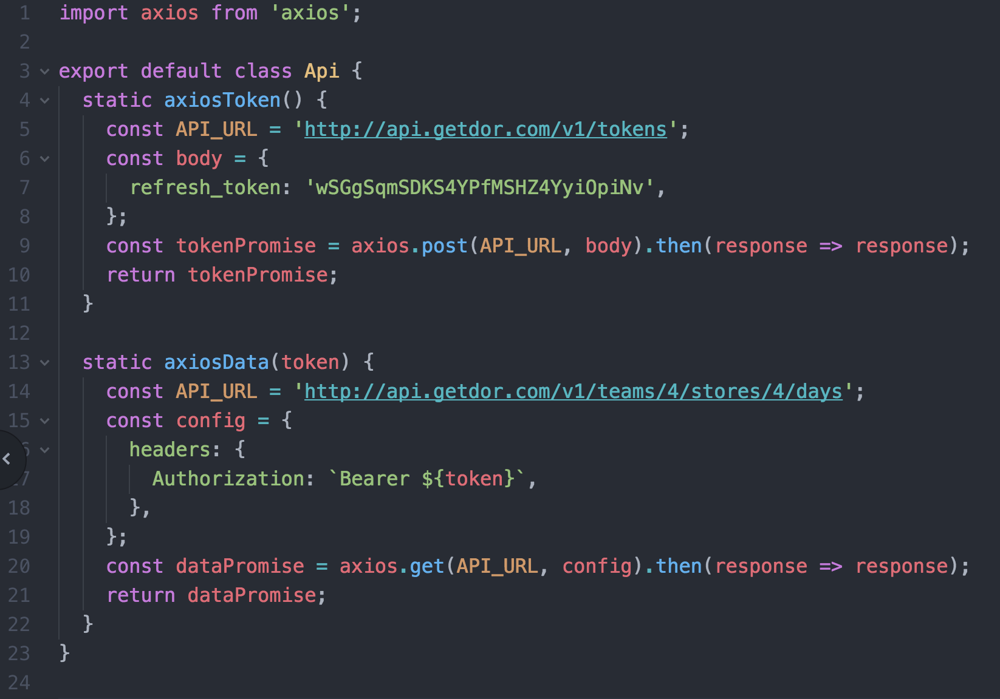

# Dor Coding Exercise #

This is a simple React/Redux application that displays the day by day in_count for a store returned by the dôr API. The in_count is the number of people who entered this demo store on that date.

## Features Of This App: ##
- List the returned days, and display the in_count for each day. Show all days returned by the API.
- A refresh button and "Last updated at" time that allows you to refresh the data
- The app displays "Loading..." while it is requesting data from the server
- The app has a few tests verifying it's functionality

Screenshot:



## To Start App ##
To utilize this repo, please do the following:

1. Fork & clone this repository
2. Do an NPM install inside your terminal to obtain necessary node modules: `npm install`
3. To run this app locally, run `npm start` inside your terminal to start up a development server with which you can preview your work at any given time.

## Testing ##
I screenshotted the testing coverage:

Test Coverage Details:
- Test coverage for components is **100%**
- Test coverage for reducers is **100%**
- Test coverage for actions is **100%**
- Test coverage for utils/Api is **100%**

NOTE: I ignore src/index.js when running the coverage. I don't need to test React Dom Render and the store since they were tested by the creators.

1. run ```npm test``` to run all the tests without the test coverage interface
2. run ```npm test -- --coverage --coveragePathIgnorePatterns src/index.js``` to run all the tests with test coverage interface( we don't need to test React Dom Render and the store since they were tested by the creators);
3. run ```npm test -- --coverage``` to run all the files with the test coverage interface
4. run ```open coverage/lcov-report/index.html ``` to open coverage files detail



## Technologies Used

The app is currently built with Javascript, React and Redux.
Other pieces of technologies include:

* [Redux-Thunk](https://github.com/gaearon/redux-thunk)(A middleware allows you to write action creators that return a function instead of an action)

I used redux-thunk-middleware to ensure the flow of actions.

## Code Refactor => Testing
You can see that the actions take in an Api Object(it lives with in the src/utils/Api.js directory). In this case, I utilized the extraArgument parameter inside the Thunk-Middleware and set my Api object as the extraArgument.

```Javascript
const store = createStore(reducer,
  window.__REDUX_DEVTOOLS_EXTENSION__ && window.__REDUX_DEVTOOLS_EXTENSION__(),
  applyMiddleware(thunkMiddleware.withExtraArgument({ Api }), promiseMiddleware()),
);
```
I used this thunk to chain my other two thunks. I make all my APIs calls action as Thunks.



This is how the Api Class look like. Notice Both Api calls ```axiosToken``` and ```axiosData``` both return ```Promises``` which are what we wanted. 



I hope you had a good time when reviewing this app. I am always open to any feedback.
