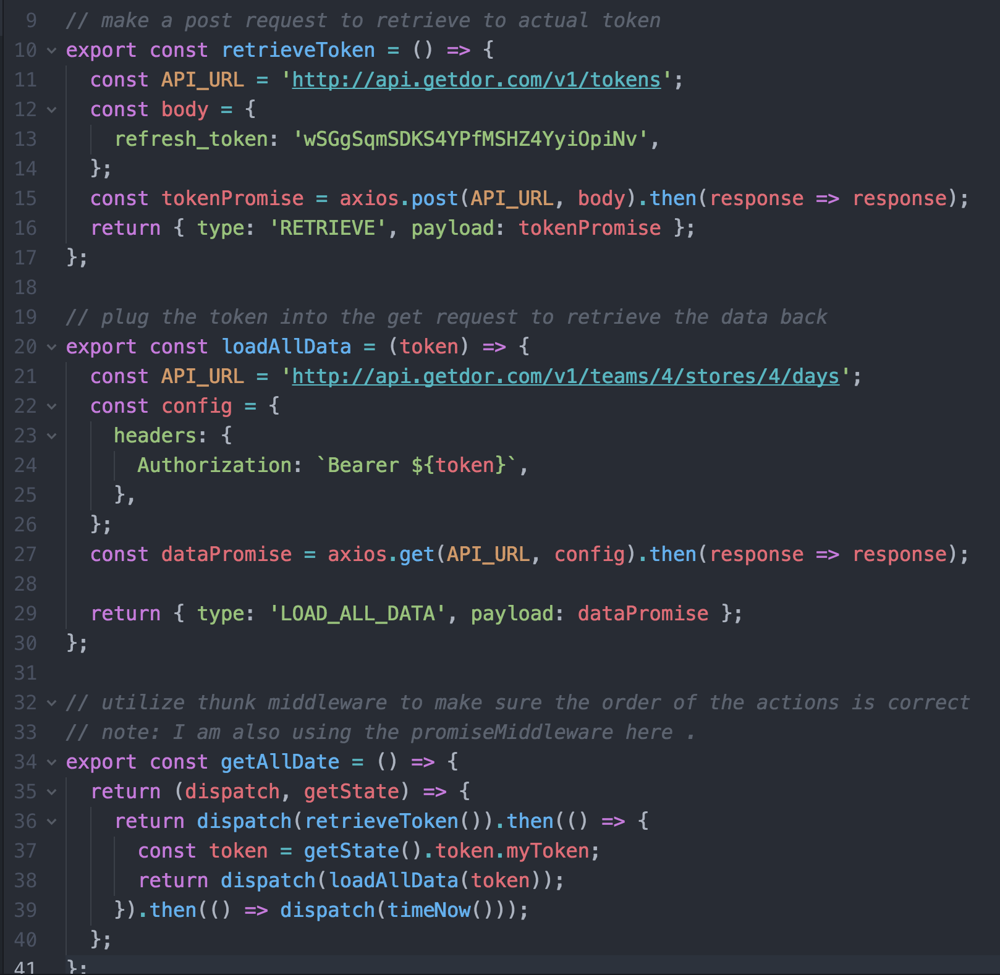
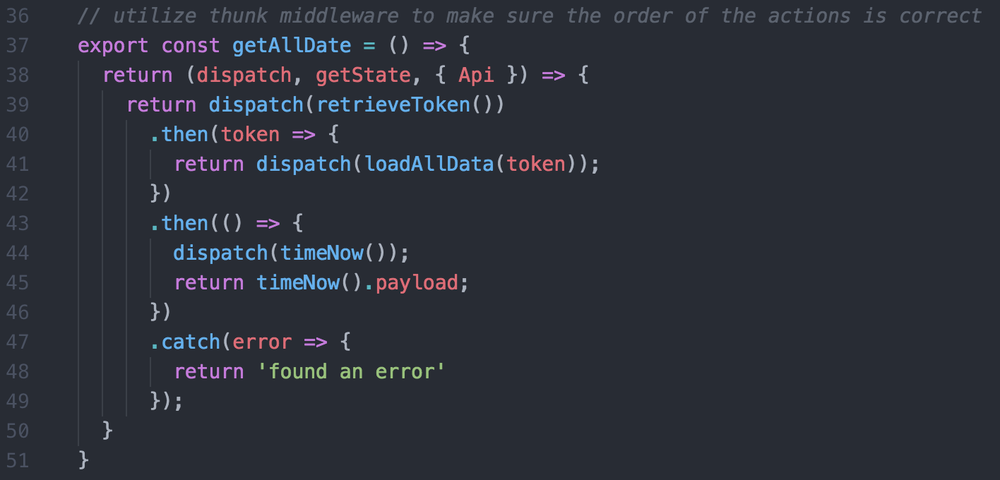

# Dor Coding Exercise

This is a simple React/Redux application that displays the day by day in_count for a store returned by the dôr API. The in_count is the number of people who entered this demo store on that date.

## Features of this app:
- List the returned days, and display the in_count for each day. Show all days returned by the API.
- A refresh button and "last refreshed at" time that allows you to refresh the data
- The app displays "Loading..." while it is requesting data from the server
- The app has a few tests verifying it's functionality


## FOR DEVELOPERS ##
To utilize our repo, please do the following:

1. Fork & clone this repository
2. Do an NPM install inside your terminal to obtain necessary node modules: `npm install`
3. To run this app locally, run `npm start` inside your terminal to start up a development server with which you can preview your work at any given time.

## Testing ##
I understand how important testing is to a company. I screenshot of the testing coverage from the terminal

I tested **Reducers, Actions,** and **Components**.

1. run ```npm test``` to run all the tests without the test coverage interface
2. run ```npm test -- --coverage``` to run all the tests with the test coverage interface


## Technologies Used

The app is currently built with Javascript, React and Redux.
Other pieces of technologies include:

* [React-Promise-Middleware](https://github.com/pburtchaell/redux-promise-middleware/blob/master/docs/introduction.md)(A middleware that will resolve a promise into one of the three results: FULFILLED, REJECTED or PENDING)

* [Redux-Thunk](https://github.com/gaearon/redux-thunk)(A middleware orchestrates an asynchronous control flow with thunk action creators dispatching each other and returning Promises to wait for each other’s completion)


## Code Refactor => Testing

In order to test asynchronous call actions, I need find ways to test them while avoiding making network request.

#### Before Refactor ####
You can see that the actions ```retrieveToken``` and ```loadAllData``` have network requests(API_URL) inside. Then I use the Thunk-Middleware to ensure the flow of actions is correct.



#### After Refactor ####
You can see that the actions take in an Api object(it lives with in the src/utils/Api.js directory). This time, both actions ```retrieveToken``` and ```loadAllData``` just know that they take in an object. From there, I can mock the two function ```axiosToken``` and ```axiosData```.

Bonus: The code is more clean and structure. I love the refactored way. In factor, I can also store future API calls inside the src/utils/Api.js directory.



This is how the Api Class look like. Notice Both Api calls ```axiosToken``` and ```axiosData``` both return ```Promises``` which are what we wanted.


**The local host server for the app is** http://localhost:3000
