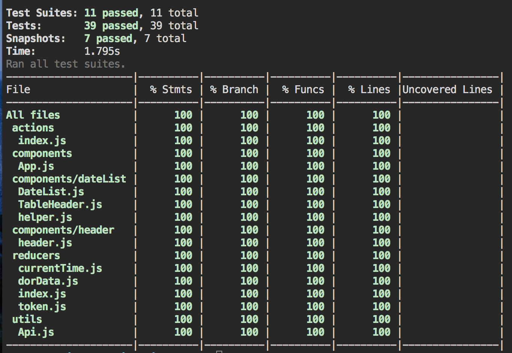

# Dor Coding Exercise #

This is a simple React/Redux application that displays the day by day in_count for a store returned by the dôr API. The in_count is the number of people who entered this demo store on that date.

## Features Of This App: ##
- List the returned days, and display the in_count for each day. Show all days returned by the API.
- A refresh button and "Last updated at" time that allows you to refresh the data
- The app displays "Loading..." while it is requesting data from the server
- The app has a few tests verifying it's functionality

This is what the product looks like:


## For Developers ##
To utilize this repo, please do the following:

1. Fork & clone this repository
2. Do an NPM install inside your terminal to obtain necessary node modules: `npm install`
3. To run this app locally, run `npm start` inside your terminal to start up a development server with which you can preview your work at any given time.

**The default local host server is** http://localhost:3000

## Testing ##
I understand the importance of testing and I screenshotted the testing coverage from the terminal

1. run ```npm test``` to run all the tests without the test coverage interface
2. run ```npm test -- --coverage``` to run all the tests with the test coverage interface

**NOTE** : I tested only **Reducers, Actions,** and **Components**.


Improvement: I would like to continue to test more functionality in the future. For now, I think the test coverage result is promising for reducers, actions, and components.

Test Coverage Details:
- Test coverage for components is **97%**
- Test coverage for reducers is **78%**
- Test coverage for actions is **67%**

## Technologies Used

The app is currently built with Javascript, React and Redux.
Other pieces of technologies include:

* [React-Promise-Middleware](https://github.com/pburtchaell/redux-promise-middleware/blob/master/docs/introduction.md)(A middleware that will resolve a promise into one of the three results: FULFILLED, REJECTED or PENDING)

* [Redux-Thunk](https://github.com/gaearon/redux-thunk)(A middleware orchestrates an asynchronous control flow with thunk action creators dispatching each other and returning Promises to wait for each other’s completion)


## Code Refactor => Testing

In the beginning, I write my actions with Api calls within them. They work perfectly fine. In order to test asynchronous call actions, I need find ways to test actions while without making network requests.

### Before Refactor ###
You can see that the actions ```retrieveToken``` and ```loadAllData``` have network requests(API_URL) inside. Then I use the Thunk-Middleware to ensure the flow of actions is correct.


### After Refactor ###
You can see that the actions take in an Api Class(it lives with in the src/utils/Api.js directory). In this case, I utilized the extraArgument parameter inside the Thunk-Middleware and set my Api object as the extraArgument.

```Javascript
const store = createStore(reducer,
  window.__REDUX_DEVTOOLS_EXTENSION__ && window.__REDUX_DEVTOOLS_EXTENSION__(),
  applyMiddleware(thunkMiddleware.withExtraArgument({ Api }), promiseMiddleware()),
);
```

This time, both actions ```retrieveToken``` and ```loadAllData``` just know that they take in an object. From there, I can simply mock the two functions within the Api Class(extraArgument in the Thunk-Middleware) ```axiosToken``` and ```axiosData```.

Bonus: The code is more module and structured. I love this refactored code. In factor, I can also store future API calls inside the src/utils/Api.js directory. If the applications get really big, this structure can potentially help the company.


This is how the Api Class look like. Notice Both Api calls ```axiosToken``` and ```axiosData``` both return ```Promises``` which are what we wanted. The promises will be taken care by the Promise middleware later.


## Room For Improvement ##

In the future I hope to build upon the following goals:

- If this app is used on mobile, I look forward to making it responsive.
- Reach higher testing coverage percentage.

I hope you had a good time when reviewing this app. I am always open to any feedback.
